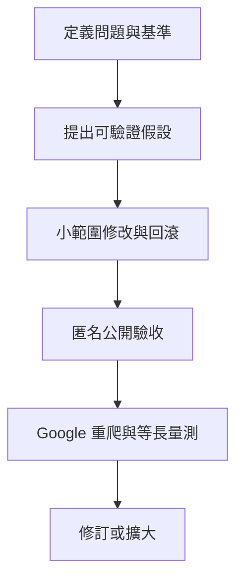

# B2B 工業網站 SEO × AIO 優化案例

> 從手機效能、三語內容與產品資料修復，走到可驗證的搜尋成效追蹤。
> 真實專案・客戶去識別化・最後更新 **2026-09-16**

**我的角色**：找出高影響問題、判斷產品資料來源、設計隔離實驗與驗收標準、決定上線範圍，並解讀搜尋結果。AI Agent 協助掃描、程式與驗證；我負責目標、取捨與成果判斷。

**能力定位**：SEO／成長行銷 × AI 工作流程 × 專案管理。這個案例呈現我如何把商業需求轉成實驗、讓 AI 協助執行，再用證據控制交付品質。

**專案目標**：讓潛在客戶找得到、看得懂工業產品，並建立可維護的 SEO／AIO 工作流程。

[成果與限制](docs/results.md) · [方法](docs/methods.md) · [最新搜尋實驗](search/english-four-page-mvp.md) · [可執行數據驗證](#重現數據判讀)

## 60 秒看成果

| 能力 | 具體工作 | 已驗證結果／界線 |
|---|---|---|
| 問題診斷與實驗 | 隔離測試首頁首屏，再決定改版方向 | Mobile LCP **13.10s → 3.16s 測試 → 2.72s 上線**；為歷史實驗量測 |
| 跨語內容與品質管理 | 三語內容、規格、FAQ、結構化資料交叉驗證 | 歷史全站驗收 **122/122 URL、116/116 視覺案例**通過 |
| Technical SEO | 修正錯誤導向語言首頁的舊網址 | **14 條**改成對應頁面的單次轉址 |
| 數據判讀 | 將全站、英文區與實驗頁分開看 | 11 日等長觀察：全站點擊 **+60%**，但英文區曝光 **−78.5%**；保留不利結果 |
| 持續改善 | 四個英文頁優化、公開驗收、追查 Google 重爬 | **8/8** 發布情境通過；截至 9/16，待重爬三頁中 **2 頁已更新**，搜尋效果仍待觀察 |

**這些不是營收成效或 SEO 因果證明。** 全站成長不能直接歸功於四個英文頁；目前也沒有 GA4／CRM 詢價歸因資料。


## 混合型職務可以看什麼

| 職務面向 | 我的責任與判斷 | 可檢查的作品 |
|---|---|---|
| SEO／成長行銷 | 搜尋意圖、技術修復、分群成效判讀 | [四頁實驗](search/english-four-page-mvp.md)、[結果與限制](docs/results.md) |
| AI 工作流程 | 把掃描與候選產出交給 Agent，以明確規則驗收 | [人與 AI 分工](docs/human-ai-workflow.md)、[可執行驗證](scripts/compare-search-windows.py) |
| 專案／品質管理 | 優先級、最小範圍、發布門檻、回滾與追蹤 | [三語漏驗改善](incidents/multilingual-false-pass.md)、[量測合約](docs/measurement-contract.md) |

## 三個值得先讀的決策

### 1. 先測瓶頸，再決定是否大改

手機首頁 LCP 約 13 秒。我先用隔離頁只替換首屏 Smart Slider 3，其餘內容盡量維持一致。測試降至 3.16 秒後，才把資源投入首屏重做，正式上線量測約 2.72 秒。

→ [首頁效能案例：問題、實驗、決策與限制](performance/isolated-first-screen-test.md)

### 2. 把「看起來完成」改成真正可驗收

有三語網址不代表三語正文完整；正文規格更新，也不代表 FAQ／JSON-LD 一起更新。我把這兩次漏驗改成逐語言、逐呈現層的公開驗證。

→ [三語漏驗](incidents/multilingual-false-pass.md) · [產品資料漂移](incidents/product-truth-drift.md)

### 3. 全站成長時，仍追查英文頁衰退

9/14 的等長觀察顯示全站點擊 60 → 96，但英文區曝光 1,760 → 379。進一步拆出四個實驗頁、檢查 Google 最後爬取，再將「發布通過」「Google 重爬」「搜尋成效」分別管理。

9/16 已確認兩頁重新爬取，一頁仍未更新；目前不能把曝光下滑全歸因於爬取延遲，也不能用平均排名變好掩蓋曝光流失。

→ [四頁英文實驗與最新診斷](search/english-four-page-mvp.md) · [量測規則](docs/measurement-contract.md)

## AIO 的實際範圍

以可見內容、清楚定義、FAQ、產品資料一致性與適當 JSON-LD，降低機器理解的歧義。沒有公開可驗證的價格或評價，就不為通過 Rich Results 捏造 Offer／rating。

單產品三語 FAQ 實驗已於 **8/21 發布**，含其他產品作為比較組；**技術交付完成，搜尋與 AI 引用效果尚未證實**。

→ [單產品實驗現況](experiments/single-product-aio.md) · [Structured Data 的取捨](docs/aio-governance.md)

## 工作方法與工具



`WordPress · Rank Math · Polylang · GSC · Python · Node.js · Playwright · Lighthouse · Git · AI Agents`

→ [資料與方法](docs/methods.md) · [人與 AI 的分工及失誤處理](docs/human-ai-workflow.md)

## 重現數據判讀

本 repo 附去識別化的實測摘要與無外部依賴的計算器。它會拒絕不等長、未完整及重疊期間，零基準不產生虛假的成長百分比。

```bash
python3 scripts/compare-search-windows.py data/search-checkpoint-2026-09-14.json
python3 scripts/test-search-windows.py
python3 scripts/validate-portfolio.py
```

[資料來源與公開邊界](docs/evidence-and-publication.md) · [更新紀錄](CHANGELOG.md) · [下一步](TODO.md)

## 目前限制

- LCP、全站驗收與 GSC 各有自己的量測日期和範圍，不能混成一次測試或當成今天的保證。
- 搜尋前後比較不是隨機對照實驗；季節、查詢組成與重爬時點都可能影響結果。
- 下一個完整觀察窗截止 9/28，需等 GSC 資料完整後才判讀；不承諾排名、AI 引用、詢價或營收。

公開 repo 為經整理的求職作品集。原始後台備份、客戶識別、私有工程資料與登入資訊不公開；範例資料與實測摘要分別標示。
