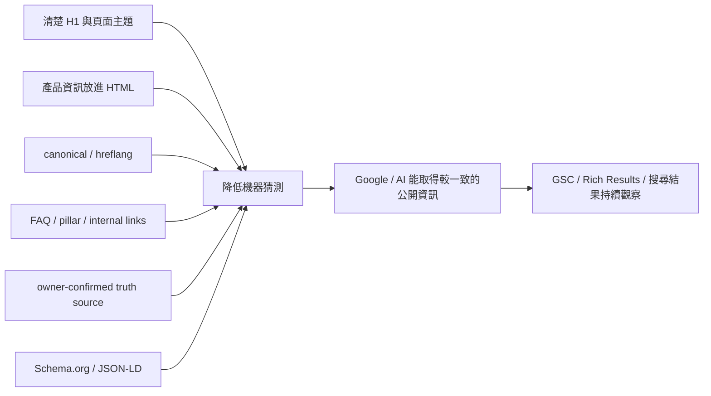

> 2026-09-16 狀態更新：單產品實驗已於 8/21 發布，成效待驗證；最新 [實驗紀錄](../experiments/single-product-aio.md) 與 [結果](results.md) 優先於下方歷史方法敘述。

# AIO 方法：讓搜尋引擎與 AI 少猜一點

## 目標

這個專案裡的 AIO 不是「多塞一些關鍵字」或「Schema 加越多越好」。我把問題定義成：

> **網站除了讓人看懂，能不能也讓搜尋引擎與 AI 更容易知道這頁在講什麼、產品是什麼、不同語言頁的關係是什麼，以及哪份產品資料才是真的？**

因此 AIO 與 SEO 並不是兩套完全分開的工作。很多基礎條件其實重疊：可讀的 HTML、清楚的頁面主題、正確的 canonical / hreflang、穩定的產品 facts、合理的 internal linking，以及搜尋引擎實際能抓到的公開內容。

---

## 使用的方法

### 1. 清楚的頁面主題

核心頁整理 H1 與第一段內容，讓頁面主要主題不要藏在模板、圖片或裝飾文字裡。

H1 在這裡不是「AI 專用技巧」，比較像頁面的主要招牌：先讓人與搜尋引擎知道這一頁主要回答什麼。

### 2. 重要產品資訊放進 HTML

產品規格若只存在圖片或 PDF，機器與使用者都比較難直接取得。因此把重要且已確認的產品資訊轉成可讀 HTML，並維持與原始 truth source 一致。

### 3. 三語關係

使用 canonical 與 reciprocal hreflang 表達繁中、簡中、英文之間的對應關係，同時確認 translated page 不只是「有 URL」，而是真的有等價內容。

### 4. Structured Data

- **Schema.org**：一套共用欄位 vocabulary，用來描述 Article、Organization 等 entity。
- **JSON-LD**：把這些欄位放進頁面的 machine-readable format。

Structured Data 的目標不是保證排名，而是讓頁面角色與資料關係更明確。

### 5. Google Search Console

GSC 不只是成果報表。它用來觀察 Google 實際知道哪些 URL、哪些頁面被索引、哪些 URL 被視為 redirect，以及 impressions / clicks / queries / pages 的變化。

專案後期就曾透過 GSC Page Indexing 發現 32 個 redirected URLs，再進一步找出其中 14 個真正錯誤的 legacy homepage fallbacks。

---

## 遇到的問題：Product Schema 不是越多越好

專案曾嘗試 Product / ProductModel structured data。

但實際用 Google Rich Results Test 驗證後，問題變得很清楚：這是一個 B2B quote-only 網站，公開頁沒有 verified：

- Offer
- price
- inventory
- review
- rating

如果為了讓 Product rich result 看起來完整而補這些欄位，就會讓 machine-readable data 比公開頁面「知道得更多」。

### 正式環境決策

- 不虛構 Offer / price / review / rating
- 移除不適合的 Product / ProductModel rich-result implementation
- 保留可由公開內容支持的 Article、Breadcrumb、Organization
- visible product content 繼續維持清楚、可讀與可驗證

我最後採用的原則是：

> **Structured Data 只能描述網站真的有、使用者也能驗證的資訊。**

---

## AIO 結果目前能說到哪裡

截至 2026/8/20 的 GSC comparison：

- AI 摘要曝光：4,428 → 5,736，總量約 **+29.5%**
- 兩個區間天數不同，日均約 75.1 → 110.3，約 **+47.0%**
- 同期整體 GSC impressions：16,100 → 21,700
- AI 摘要曝光占整體曝光比例約 27.5% → 26.4%

因此目前資料支持：

> **AI 摘要曝光增加，而且大致跟著整體搜尋可見度一起增加。**

但目前資料不支持：

> 「某個 Schema / FAQ / H1 修改造成 AI 摘要曝光提升。」

也不能說 AIO 已經讓 AI 摘要占比提高，因為占比目前大致維持同一量級。

→ [完整結果與限制](results.md)

---

## 已發布、成效待驗證的 AIO 實驗

我另外提出、並於 2026-08-21 小範圍發布的實驗：

> 只選一個產品作為 experimental group，在不虛構 Offer、price、review、rating 的前提下，強化 visible FAQ、HTML information structure 與 semantic clarity；其他可比較產品保持不變，再觀察後續 GSC 與 AI/search visibility 是否出現差異。

Agent 當時偏向正式環境的 zero-error Rich Results 策略，沒有支持把這個想法直接套到全站。

我認為這兩個目標其實不同：

- 正式環境驗證：盡量降低已知錯誤
- 實驗：控制差異，取得新的資訊

這個實驗已完成技術交付，但效果仍是**未驗證假設**，不列入搜尋成效。

→ [單一產品 AIO 實驗現況](../experiments/single-product-aio.md)

---

## AIO 的邊界

AI Agent 可以協助：

- 從已確認產品資料產生候選 FAQ
- 比對三語內容差異
- 找 internal linking 機會
- 產生 schema draft
- 找出頁面與 truth source 的矛盾
- 協助設計可量測 experiment

AI Agent 不可以：

- 猜 price / inventory / product performance
- 把 pending engineering field 當成 confirmed
- 為了通過 validator 虛構 Offer / review / rating
- 把未執行的 hypothesis 寫成結果
- 把 technical readiness 直接寫成 ranking 或 AI citation improvement

AIO 在這個案例裡是一個持續觀察的方向，不是一個已經被單一 KPI 證明完成的功能。
