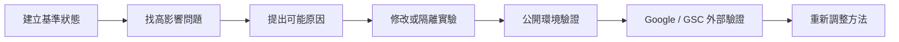
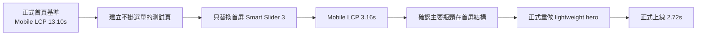

> 2026-09-16 狀態更新：單產品實驗已於 8/21 發布，成效待驗證；最新 [實驗紀錄](../experiments/single-product-aio.md) 與 [結果](results.md) 優先於下方歷史方法敘述。

# 材料與方法

這份文件只回答兩個問題：**我手上有哪些資料？我用什麼方法把 SEO 與 AIO 做起來？**

## 1. 材料與資料來源

### 網站資料

- WordPress 公開頁面
- 產品頁、技術文章、分類頁與 FAQ
- 繁中、簡中、英文三語內容
- HTML、圖片、PDF、sitemap、站內連結
- H1、title、description、canonical、hreflang、轉址

### 產品與業主資料

- 業主確認的工程規格
- 既有公開產品內容
- 歷史頁面與舊版本衍生資料
- FAQ、Schema.org / JSON-LD 與其他機器可讀資料

### 搜尋與效能資料

- Google Search Console
- Google Rich Results Test
- Lighthouse
- 匿名公開 HTML
- 桌機 / 手機截圖
- 修改前 / 修改後驗證紀錄

### 專案工作紀錄

- Agent 工作紀錄
- 修改紀錄
- 回滾紀錄
- validation JSON
- deterministic 回歸檢查

## 2. 方法總覽



整個專案不是一次性「把 SEO 設定補齊」，而是反覆執行同一個循環：先建立現況，再針對問題提出解釋，找能區分解釋的證據，修改後重新量測。

## 3. 技術 SEO

主要檢查：

- H1
- title / description
- canonical
- reciprocal hreflang
- sitemap
- HTTP status
- 轉址
- 站內連結
- 圖片狀態
- 桌機 / 手機渲染結果

目的不是追求檢查項目數量，而是確認 Google 能正確抓取、理解與導向頁面。

## 4. 內容與語意結構

主要處理：

- 核心頁的主要主題是否清楚
- 重要產品資訊是否存在可讀 HTML，而不是只藏在圖片或 PDF
- 技術文章、FAQ、支柱內容（pillar content）與產品頁是否有清楚關聯
- 三語頁是否真的有等價內容，而不只是 URL 存在
- 站內連結是否能把技術問題導向相關產品與聯絡入口

## 5. AIO / 結構化資料

我把 AIO 定義成：**降低搜尋引擎與 AI 系統對網站內容的猜測空間。**

具體處理包括：

- 清楚 H1 與頁面主題
- 可讀的產品 HTML 資訊
- canonical / hreflang 關係
- 頁面可見 FAQ / pillar content
- Schema.org / JSON-LD
- 統一產品最高資料來源
- Google Rich Results Test
- GSC 外部觀察

結構化資料的原則是「真實、可由公開頁支持」，而不是欄位越多越好。網站沒有公開 Offer、price、review、rating 時，不為了 Rich Results 補出不存在的資料。

## 6. 效能實驗

首頁效能問題採用隔離測試：



這個案例的重點不是「做了 Lighthouse」，而是利用單一主要變因的隔離測試，讓修改方向從「可能換主機」轉成「先處理首屏結構」。

## 7. 三語驗證

早期只確認 URL、H1、hreflang 等訊號，後來發現這不足以代表三語內容真的等價。

因此驗證改成逐語言檢查：

- 匿名公開 DOM
- 唯一 H1
- pillar content
- 頁內導航
- 同語系產品連結
- FAQ
- CTA
- 桌機 / 手機 overflow
- 清除 cache 後的公開結果

## 8. 產品資料一致性

同一個工程規格可能同時存在於：

```text
業主確認資料
  ↓
產品正文
FAQ
Schema.org / JSON-LD
knowledge JSON
三語頁面
```

所以規格更新不能只修改正文。專案後來改為以業主確認資料為最高來源，並對衍生內容做一致性驗證與舊值禁用檢查。

## 9. Google Search Console

GSC 在這個專案裡不是只有成果報表，也是一組外部觀察資料。

用途包括：

- 看 Google 是否持續發現與索引頁面
- 找轉址 / duplicate 等 URL 問題
- 觀察 impressions、clicks、CTR、position
- 比較修改前後的搜尋可見度趨勢

但 GSC 前後比較不是對照實驗，因此只能支持「修改後觀察到什麼」，不能單靠總覽資料證明某一個 SEO / AIO 動作造成結果。

## 10. AI Agent 的角色

AI Agent 主要用在高量工作：

- 掃描大量頁面與檔案
- 三語比較
- 產生 HTML / script 候選版本
- 產生 deterministic 驗證器
- 整理修改前 / 修改後證據
- 整理代表性工作紀錄

人的角色則是：

- 決定目標與優先順序
- 判斷資料來源是否可信
- 接受、拒絕或要求實驗驗證 Agent 建議
- 決定是否上線
- 解讀 GSC / Lighthouse / Rich Results 等外部結果

因此這個專案的人機協作是方法，不是研究問題本身。

## 11. 技術棧

`WordPress · Rank Math · Polylang · Breeze · Smart Slider 3 · Google Search Console · Google Rich Results Test · Schema.org / JSON-LD · Python · Node.js · Playwright · Lighthouse · GitHub · Google Drive · AI Agents`
